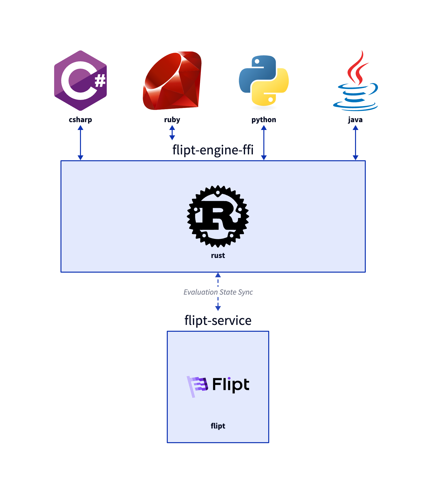
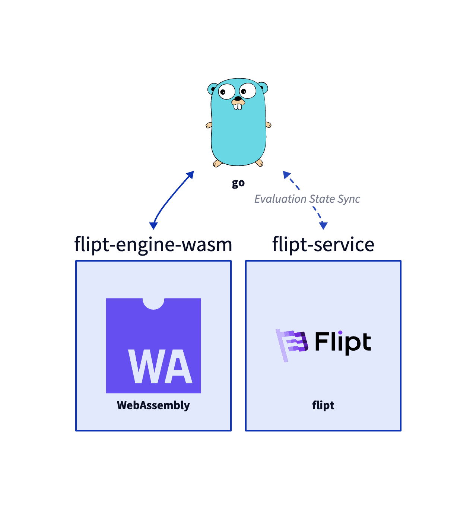

# Architecture

This document describes the architecture of the client-side SDKs for Flipt.

The Flipt client-side SDKs are currently broken down into two main implementations:

- [FFI](#ffi)
- [WebAssembly](#webassembly)

You're use case will determine which implementation is best for you. The FFI implementation is designed to be embedded in native language client SDKs, while the WebAssembly implementation is designed to be embedded in client-side SDKs that runs in the browser.

## FFI

[`flipt-engine-ffi`](./flipt-engine-ffi/) is a Rust library that polls for evaluation state from the Flipt server and uses this state to determine the evaluation results. The engine is designed to be embedded in the native language client SDKs. The native language client SDKs send context to the client engine via [FFI](https://en.wikipedia.org/wiki/Foreign_function_interface) and receive the results of the evaluation from the engine.

This design allows for the client evaluation logic to be written once in a memory-safe language (Rust) and embedded in the native language client SDKs.

You can refer to the architecture diagram below:

    

### Responsibilities

#### FFI Engine

[`flipt-engine-ffi`](./flipt-engine-ffi) uses the [`flipt-evaluation`](./flipt-evaluation) library to actually evaluate context against the evaluation state.

The [`flipt-engine-ffi`](./flipt-engine-ffi) library is responsible for the following:

- Polling for evaluation state from the Flipt server.
- Unmarshalling the evaluation state from JSON to memory.
- Implementing the store trait to allow for the evaluation state to be stored in memory and accessed by the evaluation logic in a threadsafe manner.

#### Evaluation Library

The [`flipt-evaluation`](../flipt-evaluation) library is a Rust library responsible for the following:

- Evaluating context against the evaluation state and returning the evaluation results.

The evaluation logic is extracted into a separate library to allow for the evaluation logic to be reused by both the FFI and WASM engines and eventually by Flipt itself.

#### Client SDKs

The client SDKs are responsible for the following:

- Marshalling context to JSON.
- Sending context to the engine via FFI.
- Unmarshalling the results of the evaluation from JSON to memory and returning the results to the caller.
- Providing a high-level API for the caller to interact with the client SDK.

## WebAssembly

[`flipt-engine-wasm`](./flipt-engine-wasm/) is a Rust library that compiles to [WebAssembly](https://webassembly.org/) and is designed to be embedded in the client-side SDKs that run in the browser.

The client-side SDKs send context to the client engine via the WebAssembly interface and receive the results of the evaluation from the engine.

Because of the current limitations of WebAssembly, the engine is designed to be stateless and does not poll for evaluation state from the Flipt server. Instead, the client-side SDKs are responsible for fetching the evaluation state from the Flipt server and sending it to the engine.

You can refer to the architecture diagram below:

    

### Responsibilities

#### WASM Engine

The [`flipt-engine-wasm`](./flipt-engine-wasm/) library is responsible for the following:

- Deserializing the evaluation state from JSON to memory.
- Calling the evaluation logic from the [`flipt-evaluation`](./flipt-evaluation) library to evaluate context against the evaluation state and returning the evaluation results.
- Serializing the evaluation results from memory to JSON.

#### Evaluation Library

The [`flipt-evaluation`](./flipt-evaluation) library is a Rust library responsible for the following:

- Evaluating context against the evaluation state and returning the evaluation results.

The evaluation logic is extracted into a separate library to allow for the evaluation logic to be reused by both the FFI and WASM engines and eventually by Flipt itself.

#### Browser SDK

The browser SDK is responsible for the following:

- Fetching the evaluation state from the Flipt server.
- Marshalling context to JSON.
- Sending context and the evaluation state to the engine via the WebAssembly interface.
- Unmarshalling the results of the evaluation from JSON to memory and returning the results to the caller.
