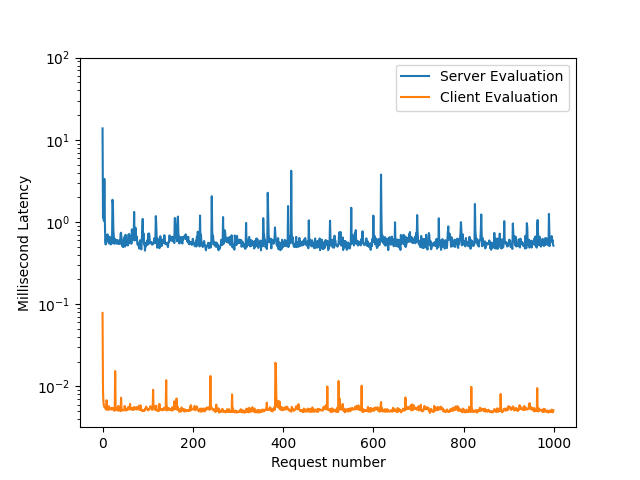

# Flipt Client SDKs

This repository centralizes the client-side SDKs for [Flipt](https://github.com/flipt-io/flipt).

These client-side SDKs are responsible for evaluating context and returning the results of the evaluation. They enable developers to easily integrate Flipt into their applications without relying on server-side evaluation.

Overall documentation for the client SDKs can be found on our [website](https://www.flipt.io/docs/integration/client).

Also, check out our introductory [blog post](https://www.flipt.io/blog/new-client-side-evaluation) on these client-side SDKs.

## Versions

There are two versions of the client SDKs:

### FFI

The [Foreign Function Interface (FFI)](https://en.wikipedia.org/wiki/Foreign_function_interface) versions of the client SDKs are currently available.

> [!IMPORTANT]
> Our FFI SDKs currently only work with OSes that use the `glibc` C library. We are working on adding support for other OSes that use `musl` such as Alpine Linux. See [this issue](https://github.com/flipt-io/flipt-client-sdks/issues/141) for more information.

### Supported Architectures

The FFI-based SDKs are currently supported on the following OSes/architectures:

- Linux x86_64
- Linux arm64
- MacOS x86_64
- MacOS arm64

### WASM

The WebAssembly (WASM) version of the client SDKs is currently in beta. This version allows you to evaluate flags in the browser using WebAssembly which is OS and architecture agnostic.

## Architecture

The client SDKs are designed to be embedded in end-user applications.

The evaluation logic is written in Rust and can be found in the [flipt-evaluation](./flipt-evaluation/) directory.

The language clients that are used in end-user applications wrap the engine can be found in the `flipt-client-{language}` directories.

See [ARCHITECTURE.md](./ARCHITECTURE.md).

## Language Support

We are constantly growing our list of supported languages.

### Released

Currently, we support the following languages/platforms:

1. [Go](./flipt-client-go) (FFI)
1. [Python](./flipt-client-python) (FFI)
1. [Ruby](./flipt-client-ruby) (FFI)
1. [NodeJS](./flipt-client-node) (FFI)
1. [Java](./flipt-client-java) (FFI)
1. [JavaScript/Typescript (Browser)](./flipt-client-browser) (WASM)

Documentation for each client can be found in the README of that client's directory.

### Planned

Languages we are planning to support:

1. [Rust](https://github.com/flipt-io/flipt-client-sdks/issues/83)
1. [C#](https://github.com/flipt-io/flipt-client-sdks/issues/310)

### Help Wanted

Languages we would like to support but lack expertise in:

1. [Kotlin](https://github.com/flipt-io/flipt-client-sdks/issues/264)
1. [Swift](https://github.com/flipt-io/flipt-client-sdks/issues/263)
1. [Flutter/Dart](https://github.com/flipt-io/flipt-client-sdks/issues/32)

Want to see a client in a language we don't support? [Open an issue](https://github.com/flipt-io/flipt-client-sdks/issues/new?assignees=&labels=new-language&projects=&template=new_language.yml) and let us know!

Alternatively, if you have experience in any of the above languages/platforms we welcome all contributions!! ❤️

## Installation

Please take a look at each client's README for installation and usage instructions.

## Use Cases

Why you may prefer to use a client-side SDK over our server-side SDKs:

1. You want extremely low-latency evaluation and high throughput.
1. You are ok with eventual consistency and can tolerate stale data for a short time.
1. You want to reduce the load in your network by not having each client make a request to the Flipt server for each evaluation.
1. You need evaluation to occur in-process for some reason (e.g. you are evaluating a flag in a web worker).

## Performance

We have done some simple benchmarking to test the performance of the client SDKs vs the server SDKs with Flipt running locally.

Here we performed 1000 evaluations of a flag using the client SDKs and the server SDKs. The client SDKs were able to perform the evaluations in a fraction of the time it took the server SDKs. This is because the client SDKs can perform the evaluations in memory without having to make a request to the Flipt server.

While the server SDKs performed evaluations in the range of 0-14ms, the client SDKs performed evaluations in the range of 0-0.1ms (100 microseconds).

## Contributing

See [CONTRIBUTING.md](./CONTRIBUTING.md).

### Help Wanted

We are not Rust experts and are constantly learning. If you see something that can be improved, especially in the [flipt-engine-ffi](./flipt-engine-ffi/) and [flipt-evaluation](./flipt-evaluation/) directories, please open an issue or a PR, we would love to learn from you. :heart:

## License

All code in this repository is licensed under the [MIT License](./LICENSE).

## Acknowledgements

- [Unleash/yggdrasil](https://github.com/Unleash/yggdrasil) - While we independently decided upon using Rust + FFI as the engine for the client SDKs, we were inspired by the design of the yggdrasil project from Unleash.
