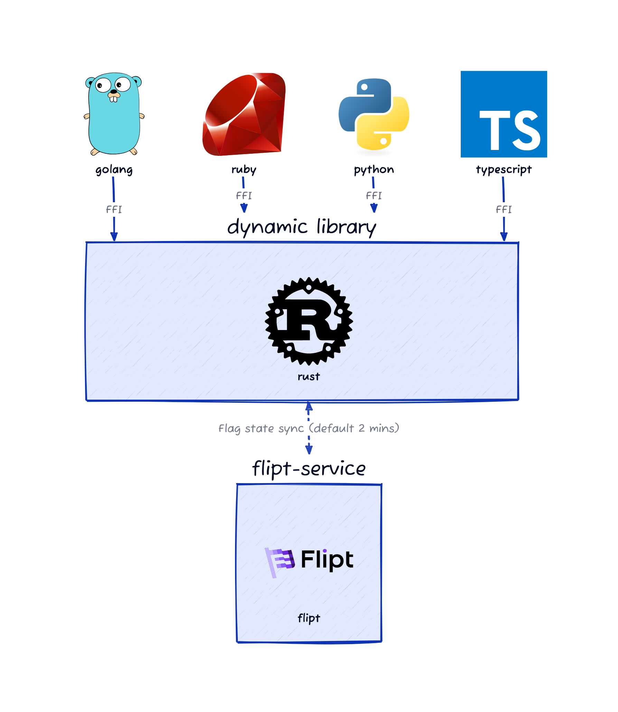

# Client SDKs

The intention of this repo is to centralize the core evaluation logic for Flipt's feature flags, and have thin multi-language wrappers around that logic.

The evaluation logic is written in Rust and can be found in the `flipt-engine` directory. The language clients that wrap the engine can be found in the `flipt-client-{language}` directories.

## Architecture

The `flipt-engine` is a Rust library responsible for evaluating context and returning the results of the evaluation. The client engine polls for evaluation state from the Flipt server and uses this state to determine the results of the evaluation. The client engine is designed to be embedded in the native language client SDKs. The native language client SDKs will send context to the client engine via [FFI](https://en.wikipedia.org/wiki/Foreign_function_interface) and receive the results of the evaluation from engine.

This design allows for the client evaluation logic to be written once in a memory safe language and embedded in the native language client SDKs. This design also allows for the client engine to be updated independently of the native language client SDKs.

You can refer to the architecture diagram below:

## Language Support

We are constantly growing our list of clients. Currently, we support the following languages:

1. [Golang](./flipt-client-go)
1. [Python](./flipt-client-python)
1. [Ruby](./flipt-client-ruby)
1. [TypeScript](./flipt-client-node)
