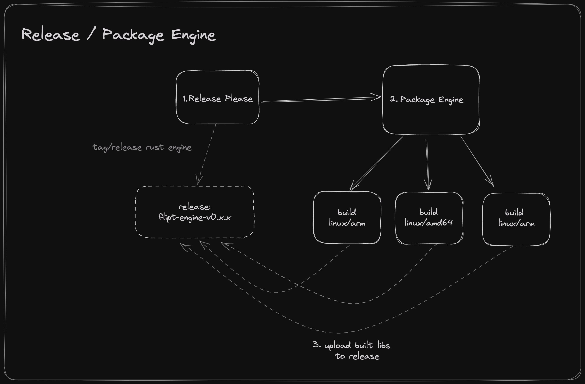
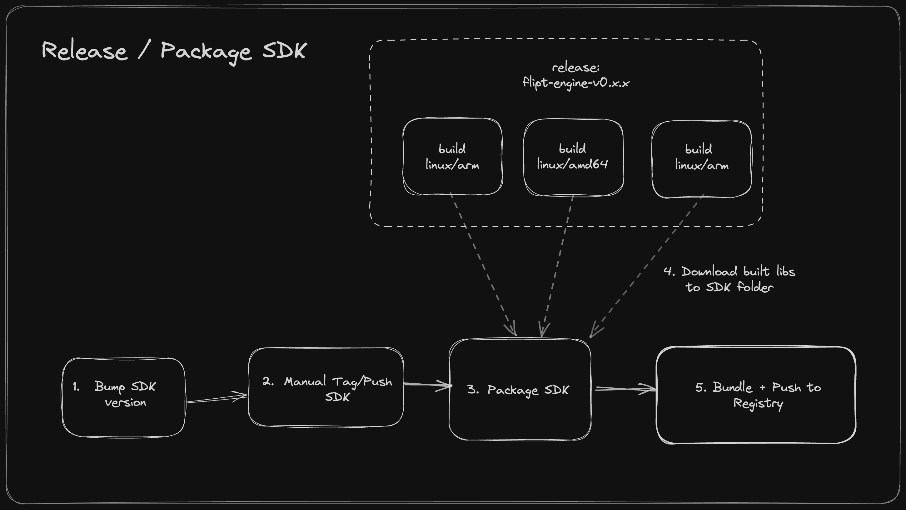

# Releasing

This describes the release process of the engine and SDKs.

## Overview

The release process is make up of two parts:

1. The release of the engine
2. The release of the SDKs

The engine is released first because the SDKs depend on the engine.

The entire process is made up of a series of GitHub Actions workflows that are triggered by a GitHub release.

We use [release-please](https://github.com/googleapis/release-please>) to generate the CHANGELOG and create the GitHub releases for the engine only.

## Release Process

### Engine

    

1. Create a new release in the [flipt-engine](./flipt-engine) by merging a change to the `main` branch that would trigger a release via conventional commits.
2. Wait for the release-please workflow to complete. This will create a new release and tag for the engine.
3. The `package-engine` workflow will run, building the engine for each supported platform and publishing the artifacts to the GitHub release.

### SDKs

    

1. Update the SDK to the new version that you want to release (i.e. update the version in `package.json` for Node, `setup.py` for Python, `flipt_client.gemspec` for Ruby).
1. Commit and tag the SDK with the new version using the naming convention `flipt-client-{language}-{version}` (i.e. `flipt-client-node-v0.1.0`).
1. Push the tag to `origin`. This will trigger the appropriate GitHub Action to build, package, and publish the SDK.

Note: In the future we can potentially automate the tagging/pushing of the SDKs via a GitHub Action or script.
