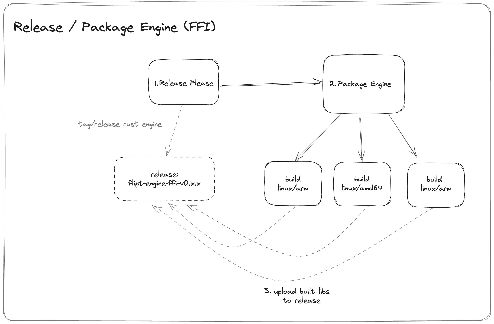
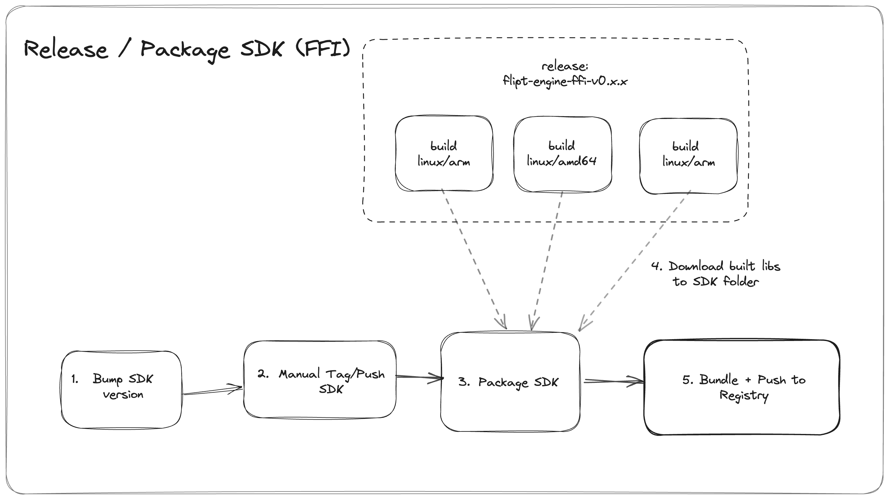

# Releasing

This describes the release process of the engines and SDKs.

## Overview

The release process is make up of two parts:

1. The release of the engines
2. The release of the SDKs

The engine is released first because the SDKs depend on the engine.

The entire process is made up of a series of GitHub Actions workflows that are triggered by a GitHub release.

We use [release-please](https://github.com/googleapis/release-please>) to generate the CHANGELOG and create the GitHub releases for the engine only.

## Release Process

### FFI

The FFI engine is released first because the SDKs depend on the engine.

#### Engine

The FFI engine gets built for each supported platform and is published to the GitHub release.

Releasing the engine is a three-step process:

    

1. Create a new release in the [flipt-engine-ffi](./flipt-engine-ffi) package by merging a change to the `main` branch that would trigger a release via conventional commits.
2. Wait for the release-please workflow to complete. This will create a new release and tag for the engine.
3. The `package-ffi-engine` workflow will run, building the engine for each supported platform and publishing the artifacts to the GitHub release.

#### SDKs

Releasing each SDK is a two to three-step process:

    

1. Update the SDK to the new version that you want to release (i.e. update the version in `package.json` for Node, `setup.py` for Python, `flipt_client.gemspec` for Ruby).
1. Commit and tag the SDK with the new version using the naming convention `flipt-client-{language}-{version}` (i.e. `flipt-client-node-v0.1.0`).
1. Push the tag to `origin`. This will trigger the appropriate GitHub Action to build, package, and publish the SDK.

Note: In the future we can potentially automate the tagging/pushing of the SDKs via a GitHub Action or script.

#### Checklist

- [ ] Update the `flipt-client-node` version in `flipt-client-node/package.json` and run `npm install`
- [ ] Update the `flipt-client-python` version in `flipt-client-python/pyproject.toml`
- [ ] Update the `flipt-client-ruby` version in `flipt-client-ruby/lib/flipt_client/version.rb`
- [ ] Update the `flipt-client-java` version in `flipt-client-java/build.gradle`
- [ ] Tag each SDK with the new version and push the tags to `origin`

### WASM

#### Engine

The WASM engine is released as a NPM package and is published to the [flipt-engine-wasm](https://www.npmjs.com/package/@flipt-io/flipt-engine-wasm) package.

1. Create a new release in the [flipt-engine-wasm](./flipt-engine-wasm) package by merging a change to the `main` branch that would trigger a release via conventional commits.
2. Wait for the release-please workflow to complete. This will create a new release and tag for the engine.
3. The `package-wasm-engine` workflow will run, building the engine and publishing the NPM package.

#### SDKs

Releasing the `flipt-client-browser` SDK is a three to four-step process:

1. Update the `flipt-engine-wasm` dependency in `flipt-client-browser/package.json` to the new version (if necessary).
1. Update the `flipt-client-browser` version in `flipt-client-browser/package.json` and run `npm install`
1. Commit and tag the SDK with the new version using the naming convention `flipt-client-browser-v{version}` (i.e. `flipt-client-browser-v0.1.0`).
1. Push the tag to `origin`. This will trigger the appropriate GitHub Action to build, package, and publish the SDK.
