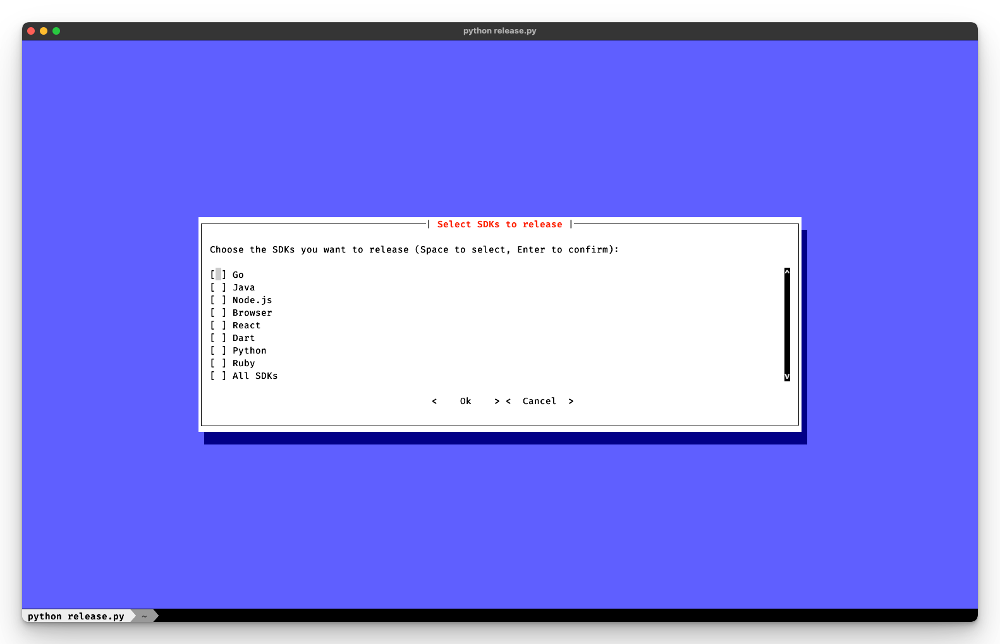

# SDK Release Script

This script automates the process of updating versions and creating tags for multiple SDKs in this project.



## Overview

The release script is designed to:

1. Allow users to select which SDKs to update
2. Choose the type of version bump (patch, minor, or major)
3. Update version numbers in SDK-specific files
4. Create and push Git tags for the new versions

## Requirements

- Python 3.7+
- Required Python packages (install using `pip install -r requirements.txt`):
  - semver
  - PyYAML
  - toml
  - prompt_toolkit
  - colorama

## Setup

```
python3 -m venv .venv
source .venv/bin/activate
pip install -r requirements.txt
```

## Usage

Run the script from the command line:

```
python release.py
```

## How It Works

1. **SDK Selection**: The script presents a list of available SDKs and allows the user to select which ones to update.

2. **Action Selection**: The user chooses whether to update versions, tag and push, or both.

3. **Version Bump Selection**: If updating versions, the user selects the type of version bump (patch, minor, or major).

4. **Version Update**: For each selected SDK, the script:

   - Reads the current version
   - Calculates the new version based on the bump type
   - Updates the version in the SDK-specific file (e.g., package.json, build.gradle)

5. **Tagging and Pushing**: If selected, the script creates Git tags for the new versions and pushes them to the remote repository.

## SDK-Specific Handling

The script uses separate classes for each SDK type to handle version reading and updating:

```12:23:release/release.py
def get_sdk(name: str, path: str) -> SDK:
    sdk_classes = {
        "flipt-client-go": GoSDK,
        "flipt-client-java": JavaSDK,
        "flipt-client-node": JavaScriptSDK,
        "flipt-client-browser": JavaScriptSDK,
        "flipt-client-react": JavaScriptSDK,
        "flipt-client-dart": DartSDK,
        "flipt-client-python": PythonSDK,
        "flipt-client-ruby": RubySDK,
    }
    return sdk_classes[name](name, path)
```

Each SDK class implements methods for getting the current version, updating the version, and handling MUSL versions if applicable.

## MUSL Support

Some SDKs (like Java and Go) have MUSL versions. The script handles these separately:

```69:73:release/release.py
        if isinstance(sdk, MuslSupportSDK):
            current_musl_version = sdk.get_current_musl_version()
            new_musl_version = bump_version(current_musl_version, bump_type)
            sdk.update_musl_version(new_musl_version)
            updated_versions[f"{sdk_dir}-musl"] = new_musl_version
```

## Error Handling

The script includes error handling to manage issues such as:

- Missing SDK directories
- Failures in reading or writing version files
- Git tagging or pushing errors

## Customization

To add support for a new SDK:

1. Create a new SDK class in the `sdks` directory
2. Implement the required methods (`get_current_version`, `update_version`)
3. Add the new SDK to the `sdk_classes` dictionary in the `get_sdk` function

## Notes

- The script assumes it's run from the `release` directory within the project structure.
- It interacts with Git, so make sure you have the necessary permissions to create and push tags.

For more detailed information on each SDK's specific implementation, refer to the individual SDK class files in the `sdks` directory.
