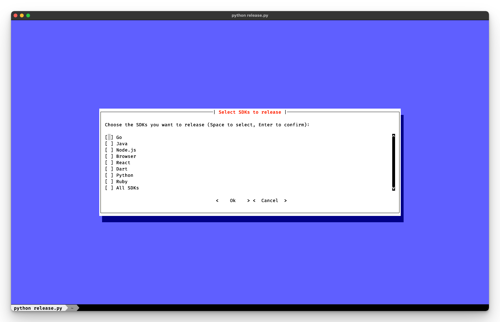

# SDK Release Scripts

Tools for releasing SDK versions in this project.



## Setup

```
cd release
python3 -m venv .venv
.venv/bin/pip install -r requirements.txt
```

## Scripts

### `release.py` — Interactive

Interactive TUI for manual releases. Guides you through SDK selection, version bump, tagging, and pushing.

```
.venv/bin/python release.py
```

### `release_cli.py` — Non-Interactive

CLI for automation and AI agents. Dry-run by default — pass `--publish` to actually release.

```bash
# Dry-run (default)
.venv/bin/python release_cli.py --sdk flipt-client-go --bump patch

# Real release
.venv/bin/python release_cli.py --sdk flipt-client-go --bump patch --publish

# Explicit version
.venv/bin/python release_cli.py --sdk flipt-client-java --version 2.0.0 --publish

# Create a PR instead of pushing to main
.venv/bin/python release_cli.py --sdk flipt-client-js --bump minor --publish --pr
```

**Options:**

| Flag | Description |
|------|-------------|
| `--sdk NAME` | SDK to release (required) |
| `--bump patch\|minor\|major` | Version bump type |
| `--version X.Y.Z` | Explicit version (instead of `--bump`) |
| `--publish` | Actually release (default is dry-run) |
| `--pr` | Create a pull request instead of pushing to main |

**Available SDKs:** `flipt-client-go`, `flipt-client-js`, `flipt-client-react`, `flipt-client-python`, `flipt-client-ruby`, `flipt-client-java`, `flipt-client-csharp`, `flipt-client-dart`, `flipt-client-swift`, `flipt-client-kotlin-android`

## How It Works

1. Reads the current version from SDK-specific files (e.g., `package.json`, `build.gradle`, git tags)
2. Calculates the new version based on the bump type
3. Updates version files in the SDK directory
4. Commits, tags, and pushes to the remote repository
5. Optionally creates a pull request

## Notes

- Both scripts must be run from the `release` directory.
- Git permissions are required to create and push tags.
- See the `sdks/` directory for per-SDK version file handling.
